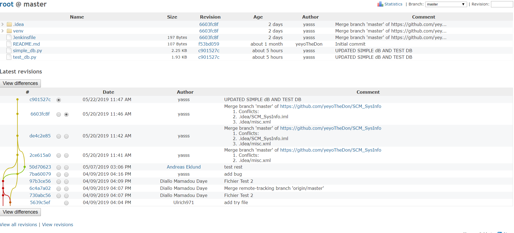
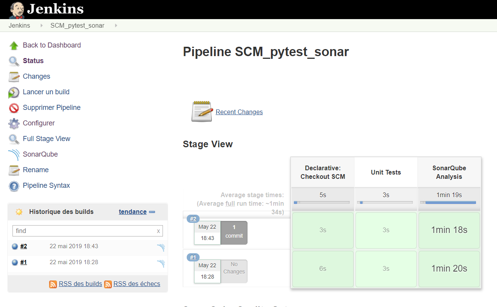

#SCM_SysInfo

##Description
Software configuration management service (SCM)

The goal of this project is to set up a software configuration management environment based on Git, Redmine and Jenkins. We wish to integrate a system that runs unit tests of an application, computes metrics and publish reports. It concerns people who knows about System Configuration Management techniques as well as people who have interest in IT, no related knowledge of the subject but wants to discover this area.

##Requirements
-   An installation of Jenkins
https://jenkins.io/download/

-   Redmine bitnami https://bitnami.com/stack/redmine

-   SonarQube 5.4 https://www.dropbox.com/s/z5uacmxr7uyrf45/sonar-scanner-2.6.1.zip?dl=0

-   Sonnar-scanner 2.6.1 https://www.dropbox.com/s/z5uacmxr7uyrf45/sonar-scanner-2.6.1.zip?dl=0

##Building & Running
On Redmine:
1.  In git bash, change directory to your Redmine location,the command is :

        cd /c/Bitnami/redmine-4.0.3-2
        
2.  Create and clone the repo, the command is :

        git clone --mirror https://github.com/yassine-dridi/SCM_SysInfo.git

3.  Develop the application with unit tests in python language.

On Jenkins:
1.  Create a Jenkins file with 2 stages :
    -   One for unit test
    -   Another one for SonarQube
2.  Create a pipeline on Jenkins linked with our git repository

##Usage

On Redmine:
1.  Sign in bitnami (top right) 

    administration --> project --> create a new project
        
2.  Select it --> repositories (the option within the project)
and then paste the local path to the git.

    In my case it was :

        C:\Bitnami\redmine-4.0.3-2\SCM_SysInfo.git

    Check the box and save

    Then proceed to "repositories" tab at the top 

    

On Jenkins:

1.  CLick into the your project pipeline and click on "Build now(Lancer un build)"

2.  Click on the console output and at the end of the page, there is a link which returns the page of Sonar.

    You can analyse and see some metrics

##Github repository
https://github.com/yassine-dridi/SCM_SysInfo.git

